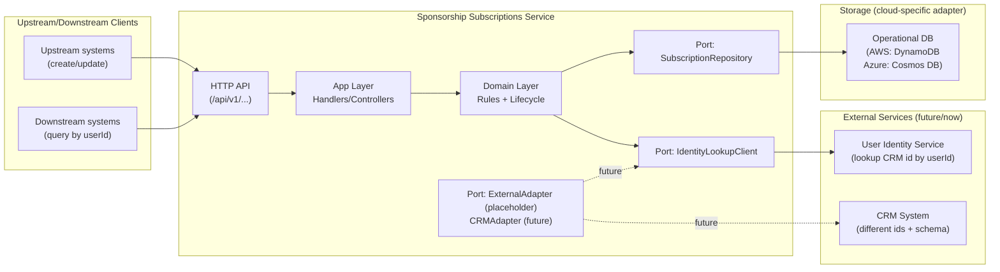
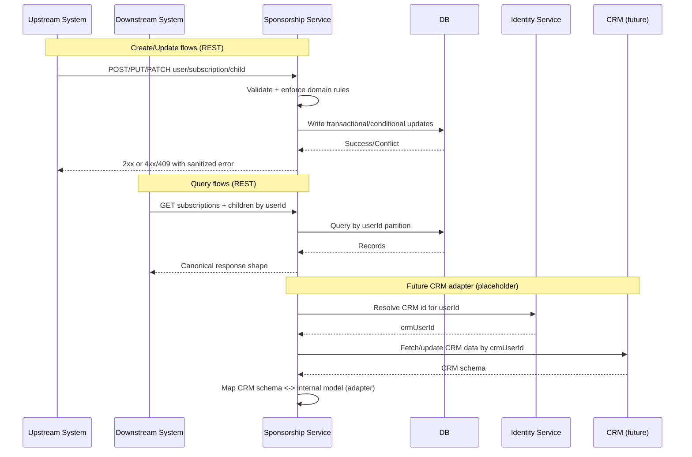

# AI IDE Implementation Prompts — Sponsorship Subscriptions Service (v1.0.0)

**Prompt set version:** v1.0.0  
**Service (repo) name:** `sponsorship-subscriptions-service`  
**Goal:** A serverless, TypeScript, API-first microservice that manages the sponsorship lifecycle:
- User (UUID) → Subscriptions (UUID) → Child records (1..n; exactly one active child per subscription)
- Upstream systems can create/update users, subscriptions, children and statuses
- Downstream systems can query subscriptions + children by userId
- Multi-cloud infra: AWS (Terraform) + Azure (Bicep)
- GitHub Actions pipeline with four gated stages: Test → Build → Deploy(GREEN) → Test Infra/Integration & Switch Blue/Green
- Placeholder architecture for external adapters (e.g., CRM) without implementing them yet
- REST APIs only (no events in v1)

**Hard constraints:** Must comply with `agents.md` for repo structure, TypeScript strictness, tests, security checks, and CI/CD workflow rules.

---

## Mermaid diagrams (architecture + data flow)

### A) Service architecture (ports & adapters)

### B) Data flows (create/update/query + future CRM sync)

---

## Domain model & rules (v1)

### Entities
- **User**
  - `userId` (UUID, from identity service)
- **Subscription**
  - `subscriptionId` (UUID, from subscription service)
  - `status`: `active | paused | cancelled`
- **ChildRecord** (belongs to a subscription)
  - `childId` (string format `ABC-XXXXXX-XXXX`)
  - `status`: `active | replacing | replaced | cancelled | dropped`
  - `startDate` (required, ISO 8601 date)
  - `endDate` (optional, ISO 8601 date)
  - `firstName` (string)
  - `lastName` (string)
  - `sponsorshipStartDate` (required, ISO 8601 date)
  - `sponsorshipEndDate` (optional, ISO 8601 date)

### Validation rules (must be enforced at API boundary + domain layer)
- `userId` and `subscriptionId` must be valid UUIDs.
- `childId` must match: `^[A-Z]{3}-\d{6}-\d{4}$`
- Dates must be valid ISO 8601 date strings; `endDate` >= `startDate` when both exist.
- `sponsorshipEndDate` >= `sponsorshipStartDate` when both exist.
- A **subscription can have multiple child records but must have at most one `active` child record at any time**.
- Optional stricter rule (recommended for operational sanity): allow at most one “current” record where `status in {active, replacing}`; `replacing` must eventually transition to `active` or `cancelled/dropped`.

### Lifecycle expectations (guidance)
- When a child is replaced:
  - existing active record becomes `replaced` and gets end dates
  - new record becomes `active` (or `replacing` briefly, if you need a two-step process)
- When subscription becomes `cancelled`:
  - active child record should transition to `cancelled` (or `dropped` if that’s a program rule)
  - set end dates appropriately

---

## Prompt 00 — Read standards and write a short service spec
1) Read `agents.md` and treat it as binding.
2) Create `docs/service-spec.md` capturing:
   - domain model, statuses, rules (as above)
   - API endpoints (v1)
   - storage approach (AWS DynamoDB + Azure Cosmos DB)
   - blue/green deployment approach for both clouds
   - adapter strategy (ports & adapters), including CRM placeholder

**Acceptance criteria**
- The repo has a clear spec that matches the requirements and constraints.

---

## Prompt 01 — Scaffold repo structure and baseline tooling
Create repo with the standard microservice layout:
- `src/app`, `src/domain`, `src/infra`, `src/config`, `src/utils`
- `tests/unit`, `tests/integration`
- `.github/workflows`
- `infra/aws` (Terraform), `infra/azure` (Bicep)
- `README.md`, `.env.example`, `LICENSE` (MIT)

Tooling requirements:
- TypeScript strict mode enabled
- ESLint + Prettier (CI-blocking)
- Jest (unit + integration) with coverage thresholds enforced
- CodeQL + npm audit in CI (per agents)

**Acceptance criteria**
- Local commands exist and run: lint, typecheck, format check, unit tests, integration tests, build.

---

## Prompt 02 — Define public API contracts (types + validation)
Define TypeScript contracts + runtime validation for:
- User create/update payload (minimal: userId only, plus future-friendly metadata)
- Subscription upsert (userId + subscriptionId + status + optional metadata)
- Child record upsert for a subscription (all required fields + statuses + dates)
- Status update operations and end-date updates

Rules:
- All request/response shapes are versioned under `/api/v1/...`
- Validation errors map to HTTP 400; conflicts to 409; missing records to 404
- Never reuse persistence models as API models without explicit mapping

**Acceptance criteria**
- Contracts are strongly typed and validated at boundaries.
- Error responses are consistent and sanitized.

---

## Prompt 03 — Define domain services enforcing invariants
Implement domain logic (pure, testable) that enforces:
- UUID and `childId` format constraints (boundary validation + domain invariants)
- Subscription status transitions
- Child record status transitions
- “Only one active child per subscription” invariant (hard requirement)
- Idempotency for upstream calls where feasible:
  - creating existing user/subscription/child should be safe or return a clear conflict depending on endpoint semantics

**Acceptance criteria**
- Unit tests cover the invariant enforcement and lifecycle transitions.
- Domain logic is independent of cloud SDKs.

---

## Prompt 04 — Storage model: design for AWS (DynamoDB) and Azure (Cosmos DB)
Design a cloud-agnostic repository interface, then implement per-cloud adapters.

### DynamoDB (AWS) recommended access patterns
Primary queries required:
- Get all subscriptions + children by `userId`
- Get subscription by `userId + subscriptionId`
- Enforce “one active child per subscription”

Recommended approach:
- Single-table design keyed by `userId` partition:
  - Subscription items and child record items co-located under the userId partition
  - Sort keys structured to support querying per subscription and ordering child records
- Use conditional writes / transactions where needed to enforce single-active-child invariants.

### Cosmos DB (Azure) recommended access patterns
- Partition by `userId`
- Store documents for subscriptions and child records with a `type` discriminator
- Use transactional batch (within a partition key) where needed for invariant enforcement.

**Acceptance criteria**
- Storage design is documented in `docs/storage-design.md`.
- Repository port is implemented with both AWS and Azure adapters behind interfaces.

---

## Prompt 05 — Implement REST endpoints (upstream and downstream)
Implement these v1 endpoints (you may refine naming but keep semantics):

### Upstream (create/update)
- Upsert/Create user
- Upsert/Create subscription for user
- Upsert/Create child record for subscription
- Update subscription status
- Update child record status and/or end dates

### Downstream (read)
- Get all subscriptions (with child records) by `userId`
- Optional: get a specific subscription by `userId + subscriptionId`

Rules:
- API-first REST; JSON only
- All endpoints are stateless and serverless-friendly
- No cross-service DB reads; only call out to identity service via a client interface (for future adapter use)

**Acceptance criteria**
- Integration tests cover create/update/query happy paths and key error paths.

---

## Prompt 06 — Placeholder external adapter architecture (CRM)
Add a placeholder adapter package/module without implementing CRM:
- Define a port/interface: `ExternalSponsorshipAdapter` (or similar)
- Define a concrete stub: `CrmAdapter` with unimplemented methods that clearly throw “not implemented”
- Define a mapping contract module:
  - internal canonical model ↔ external CRM model (types only for now)
- Define an identity lookup port:
  - `IdentityLookupClient` with method to resolve `crmUserId` by `userId`

Rules:
- Do not call CRM in v1 runtime paths.
- Keep the adapter fully optional and feature-flagged/off by default.

**Acceptance criteria**
- The architecture allows adding CRM support later without touching domain invariants or storage models.

---

## Prompt 07 — Configuration, secrets, and PII-safe logging
Configuration module must:
- validate all env vars on startup
- include serviceName, environment, log level, and allowed CORS origins
- include identity service base URL (for future use)
- include DB configuration (table/container names)
- include feature flags (CRM adapter disabled by default)

Logging must:
- be structured (pino-like)
- include requestId/correlationId
- never log child first/last name or other sensitive data in info logs
- log sanitized errors with stack traces server-side only

**Acceptance criteria**
- A “PII logging” unit test exists that ensures sensitive fields are not logged by default helpers.

---

## Prompt 08 — Build artifacts and serverless wrappers (AWS + Azure)
Implement cloud runtime wrappers:
- AWS: Lambda handlers behind API Gateway, with minimal glue logic
- Azure: Functions HTTP triggers, with minimal glue logic

Rules:
- Core handlers remain cloud-agnostic.
- SDK usage is isolated in infra adapters.
- Keep cold start overhead minimal.

**Acceptance criteria**
- A local harness or lightweight emulator approach exists for running handlers in CI integration tests.

---

## Prompt 09 — AWS infrastructure (Terraform in `infra/aws`)
Provision serverless AWS resources:
- API Gateway (HTTP API preferred) routing to Lambdas
- Lambda functions (ingress + query; optionally separate functions per route if that’s cleaner)
- DynamoDB table (single-table design) with TTL if applicable
- CloudWatch logs
- IAM roles/policies (least privilege)
- Optional: WAF / throttling settings (can be defaulted off for dev)

Blue/Green approach (AWS):
- Use Lambda versions + **alias** for “BLUE” vs “GREEN”
- Stage 3 deploy publishes GREEN version and points GREEN alias (or stage) to it
- Stage 4 runs integration tests against GREEN endpoint
- Only on success, update live alias to GREEN; on failure keep BLUE alias

Terraform state must be remote and not stored in the repo; document required backend config.

**Acceptance criteria**
- `terraform plan` works with required inputs only.
- Outputs include GREEN endpoint for testing and active endpoint for consumers.

---

## Prompt 10 — Azure infrastructure (Bicep in `infra/azure`)
Provision serverless Azure resources:
- Function App (Consumption or Premium; prefer Consumption unless you have a clear need to diverge)
- Storage account required for Functions
- Cosmos DB NoSQL database+container (partition key `/userId` or equivalent)
- Key Vault (if you store sensitive config) + Managed Identity
- Application Insights

Blue/Green approach (Azure):
- Use **deployment slots** (production = BLUE; staging slot = GREEN)
- Stage 3 deploy goes to GREEN slot only
- Stage 4 tests target the GREEN slot URL
- Only on success, swap slots; on failure, no swap (or swap back if partially done)

**Acceptance criteria**
- Bicep deploy works with required inputs only.
- Outputs include slot URLs needed for CI.

---

## Prompt 11 — GitHub Actions (four-stage pipeline + cloud selection)
Implement workflows per `agents.md`:
- Deterministic cloud choice:
  - If workflow input `cloud` set: use it and validate required vars
  - Else auto-detect; if both configured fail; if none configured fail
- Stage 1 (Test): lint, typecheck, format check, unit tests + coverage, CodeQL, npm audit, plus any repo-specific checks
- Stage 2 (Build): produce immutable artifacts
- Stage 3 (Deploy GREEN): apply infra + deploy app to GREEN (AWS alias or Azure slot)
- Stage 4 (Test + Infra security + Switch):
  - run integration tests against GREEN
  - run infra security tests (IaC scanning + validation)
  - only if both pass: switch traffic to GREEN
  - else fail workflow and ensure traffic remains on BLUE (rollback)

**Acceptance criteria**
- A push to `develop` deploys to dev; `release` to staging; `main` to prod (unless repo documents otherwise).
- Stage 4 failure leaves production stable.

---

## Prompt 12 — Integration test suite (GREEN verification)
Create Stage-4 integration tests that:
- create or upsert a user
- create a subscription for that user
- add a child record (active) to that subscription
- replace the child record (enforcing single-active-child constraint)
- query by userId and assert returned structure and statuses are correct
- assert invalid childId format is rejected
- assert attempting to create a second active child for same subscription fails (409)

Rules:
- tests must be deterministic and bounded (retries/timeouts)
- do not depend on external networks beyond the deployed service endpoints
- do not log PII

**Acceptance criteria**
- Tests reliably pass against GREEN in both clouds.

---

## Prompt 13 — Documentation and onboarding
Update `README.md` to include:
- Service purpose and lifecycle model
- API summary and examples (high level; no secrets)
- Local development (how to run tests)
- Deployment instructions (AWS + Azure) including required GitHub vars/secrets for OIDC
- Blue/green behavior and rollback behavior
- Data model constraints (single active child per subscription)

**Acceptance criteria**
- A new user can fork/template, configure secrets, deploy, and run integration tests.

---

## Prompt 14 — Final verification checklist
Before calling done:
- All Stage 1 checks pass
- Both AWS and Azure infra deploy successfully (independently)
- Stage 4 tests pass and traffic switching works
- Stage 4 failure path keeps BLUE active and does not break production
- No secrets or PII in logs; no secrets in repo
- CRM adapter placeholder exists and is clearly isolated

**Acceptance criteria**
- Service is production-grade and open-source-ready under MIT with multi-cloud serverless deployment.
